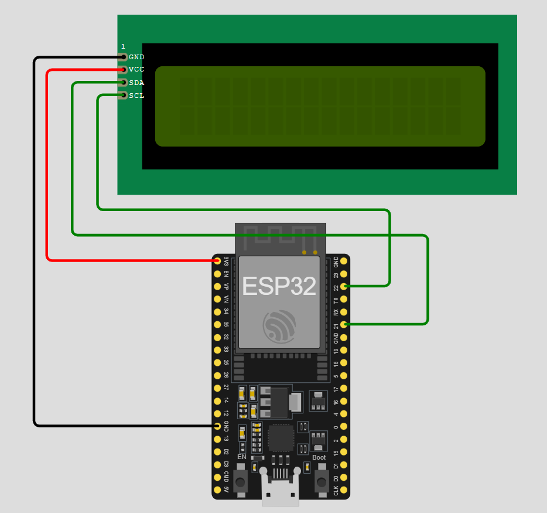
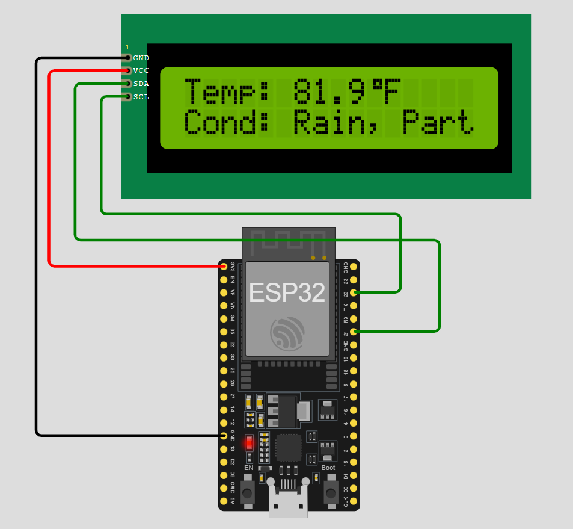

# Weather Station Demo project using ESP32 and Visual Crossing Weather API

This project demonstrates how to build a simple weather station using an ESP32 microcontroller and an LCD display. The weather data, including temperature and conditions, is fetched from the Visual Crossing Weather API and displayed on the LCD.

## Components Used

- ESP32 Development Board
- I2C LCD Display (16x2)
- Jumper Wires
- Breadboard (optional)

## Circuit Diagram

Connect the components as follows:

- **ESP32 Pin** | **LCD Pin**
- ------------ | -------------
- 3V3          | VCC
- GND          | GND
- GPIO 21      | SDA
- GPIO 22      | SCL



## Configuration

### `platformio.ini`

Ensure your `platformio.ini` file is configured as follows:

```ini
[env:esp32]
platform = espressif32
framework = arduino
board = esp32dev
lib_deps =
  bblanchon/ArduinoJson @ ^6.18.5
  LiquidCrystal_I2C
```

### `wokwi.toml`

Ensure your `wokwi.toml` file is configured as follows for simulation in Wokwi:

```toml
[wokwi]
version = 1
elf = ".pio/build/esp32/firmware.elf"
firmware = ".pio/build/esp32/firmware.bin"

[[net.forward]]
from = "localhost:8180"
to = "target:80"
```

## Code Explanation

### Libraries

- `WiFi.h`: Library to handle WiFi connectivity.
- `HTTPClient.h`: Library to make HTTP requests.
- `Wire.h`: Library to handle I2C communication.
- `LiquidCrystal_I2C.h`: Library to control the LCD display.
- `ArduinoJson.h`: Library to parse JSON responses.

### Setup Function

- **Initialize Serial Communication**: `Serial.begin(115200);`
- **Initialize I2C for LCD**: `Wire.begin(21, 22);`
- **Initialize LCD**: `lcd.begin(16, 2);`
- **Connect to WiFi**: `WiFi.begin(WIFI_SSID, WIFI_PASSWORD);`
- **Fetch Initial Weather Data**: `fetchWeatherData();`

### Loop Function

- Fetch weather data every 60 seconds.
- Display the fetched temperature and weather condition on the LCD.

### Fetch Weather Data Function

- **Check WiFi Connection**: Ensure the ESP32 is connected to WiFi.
- **HTTP GET Request**: Fetch data from the Visual Crossing Weather API.
- **Parse JSON Response**: Use ArduinoJson to parse the temperature and condition.
- **Display Data on LCD**: Display the temperature and condition on the LCD.

### Display Data on LCD

- **Clear the LCD**: `lcd.clear();`
- **Set Cursor and Print Temperature**: `lcd.setCursor(0, 0); lcd.print("Temp: "); lcd.print(temperature); lcd.print("C");`
- **Set Cursor and Print Condition**: `lcd.setCursor(0, 1); lcd.print("Cond: "); lcd.print(condition);`

## How to Run

1. **Install PlatformIO**: Ensure you have PlatformIO installed in your Visual Studio Code.
2. **Create a New Project**: Create a new PlatformIO project for ESP32.
3. **Copy the Code**: Copy the provided code into the `src/main.cpp` file of your project.
4. **Configure `platformio.ini`**: Ensure your `platformio.ini` file is configured as mentioned above.
5. **Build and Upload**: Build and upload the code to your ESP32 board.
6. **View Output**: Open the serial monitor to view the output and see the weather data displayed on the LCD.

## Sample Output

- **Serial Monitor**:
  ```
  {"queryCost":1,"latitude":40.7146,"longitude":-74.0071,"resolvedAddress":"New York, NY, United States","address":"New York, NY","timezone":"America/New_York","tzoffset":-4.0,"days":[{"temp":81.9,"conditions":"Rain, Partially cloudy"}]}
  Weather Condition: Rain, Partially cloudy
  Temperature: 81.90
  ```

- **LCD Display**:
  ```
  Temp: 81.9°F
  Cond: Rain, Part
  ```
  

## Troubleshooting

- **WiFi Connection Issues**:
  - Ensure the WiFi credentials (SSID and Password) are correct.
  - Check the WiFi signal strength.
- **LCD Display Issues**:
  - Verify the I2C address of the LCD.
  - Ensure proper connections (SDA, SCL, VCC, GND).

## License

This project is licensed under the GNU GPL. See the [LICENSE](LICENSE) file for details.

## Acknowledgements

- [PlatformIO IDE](https://platformio.org/platformio-ide) for embedded development.
- [Visual Crossing Weather API](https://www.visualcrossing.com/weather-api) for providing weather data.
- [Wokwi](https://wokwi.com/) for providing an excellent online simulation environment.
